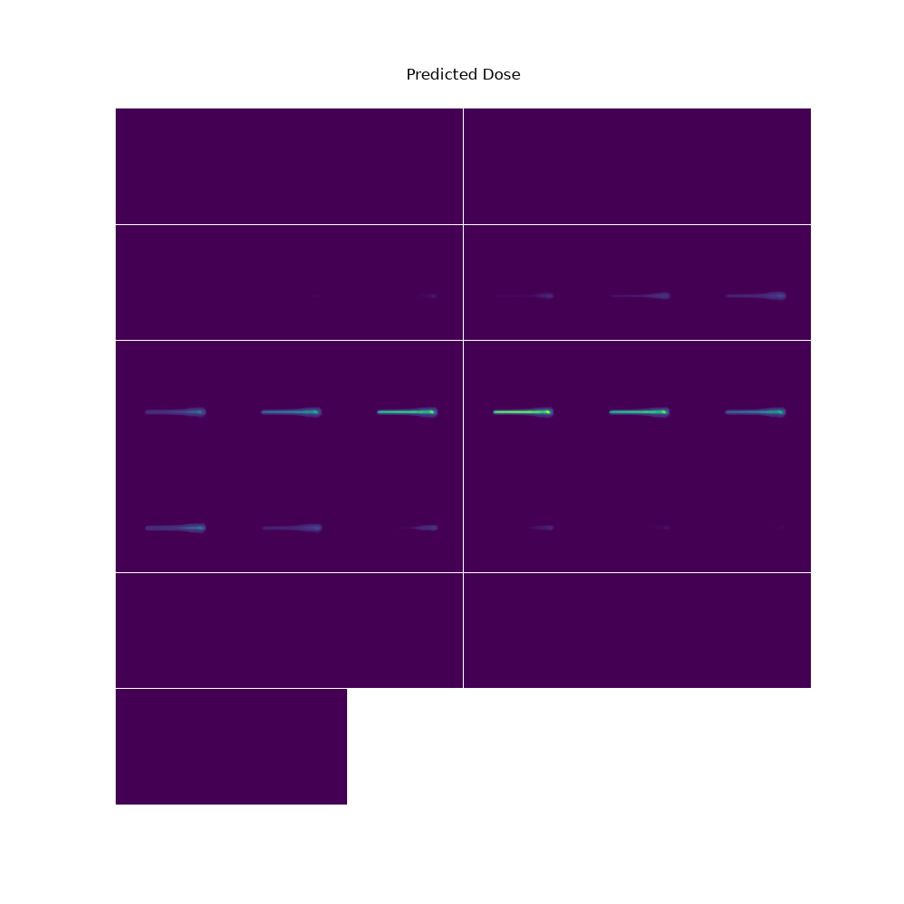
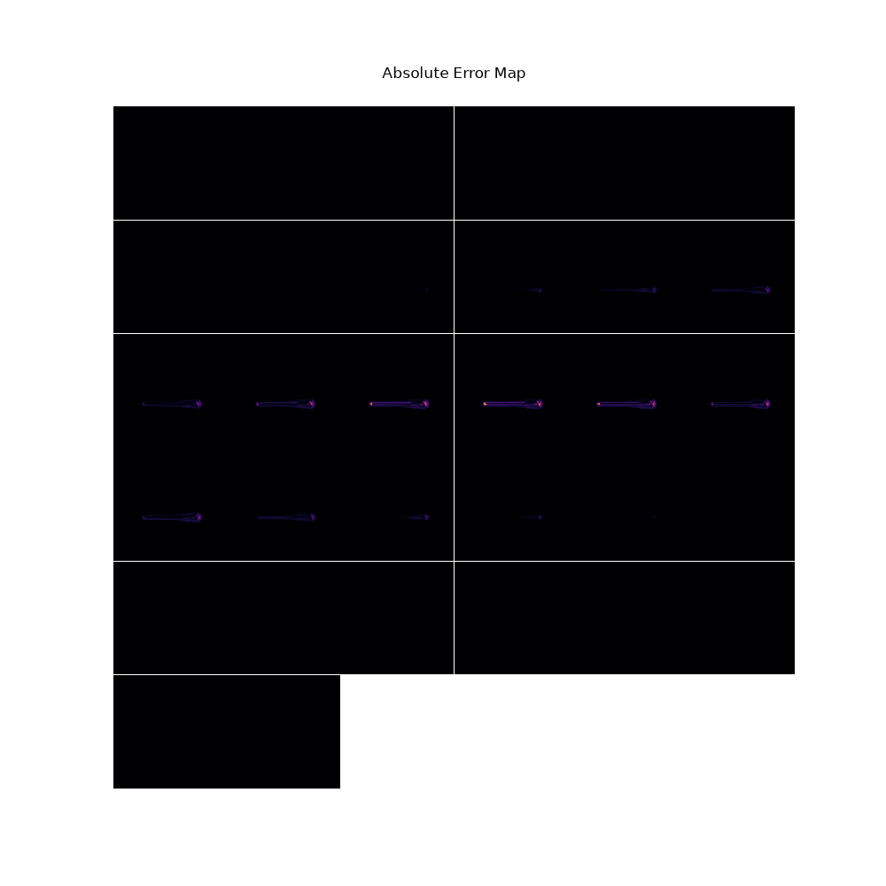

# Proton dose calculations
Proton therapy is an alternative for traditional radiation treatment. Due to the nature of protons (which is some particle physics black magic, we will not look deeply into), they deposit their energy in a more concentrated manner. This simply means that they do more harm in a smaller area, compared to traditional photons. In cancer treatment, where you want to harm the malignant cells and minimize the harm done in the healthy tissues proton treatment would be a fantastic idea. The only problem is our treatment planning methodologies were not originally designed for protons. In this work we are focusing on a development for proton dose map calculations in different body regions from CT images. In my other works you can see I work on Proton Computed Tomography (doing CT with protons for proton treatment), yet here we will try to develop a model that will predict the energy deposition distribution, using the CT images and the initial kinetic energies of the incoming protons. Later in the future we want to combine this with the pCT prediction algorithms, to see its effect on the model performance

## Data
We are building our dataset for multiple body regions and in case of publication we will cite all of the sources. For CT simulations we use [openGate](https://opengate.readthedocs.io/en/latest/introduction.html), which is a particle physics simulation tool for medical cases. Before you ask: Yes it can generate good quality synthetic data for training, but it is too slow for medical use.

Data is acquired from:
- [ct-scan-dataset](https://github.com/google-deepmind/tcia-ct-scan-dataset)
- [FLARE22](https://zenodo.org/records/7860267)
- [open-kbp](https://huggingface.co/datasets/oxkitsune/open-kbp/viewer)
- [ct-rate(subset)](https://huggingface.co/datasets/ibrahimhamamci/CT-RATE)
## Methods
### Related works (in short)
The base for our model is coming from the state of the art model [DoTa](https://iopscience.iop.org/article/10.1088/1361-6560/ac692e) (Dose Transformer), which is basically a Convolutional Autoencoder to process the 3D images into a compressed latent space and a latent transformer to actually predict the latent representation for the dose distribution. The only problem for this approach is that beams can come from multiple directions and it is expensive to rotate 3d images. Therefore we need a model that can handle dose distribution generation from every angle. There is an existing [model](https://arxiv.org/abs/2602.04375) that solves this problem too, by introducing a geometric prior. This is a guiding mask for the model to know from which angle it should generate the dose distribution maps.

### Our ideas
As we started to work on the project one of the main ideas was that we should try to develop an even closer approximation for the dose distributions. We've calculated the energy dependent expected start and endpoint of the doses and built an extra prior for the model. The issue we had so far with the predictions, that they are always "longer" than the target maps. It means in the 2D slices of the 3D image, the dose maps, that are looking like tubes, are longer in case of prediction compared to the targets.
As shown in:

  

I'm currently working on a latent regressor, that should be able to predict the start-endpoint of the "tubes". If the model can predict these values it means the information flow was lost in the training loop or just dominated by a wrong loss weight. If the model is unable to predict it with high accuracy it means that we lose this information in the encoding part.
